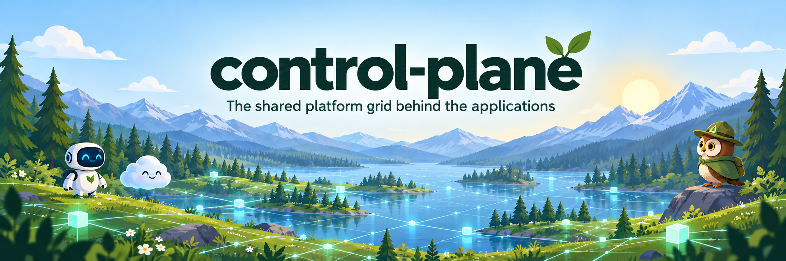
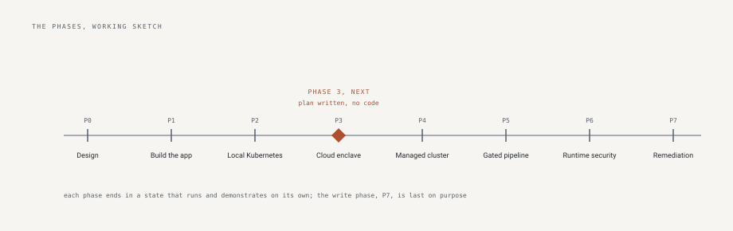

# control-plane

control-plane is a security engineering program that one person is
building in public with an AI coding agent. The agent writes the code
and the documents; the person reviews and approves every change; every
decision and every mistake is recorded. It has three parts.

**build-doctrine, the rules**

- Rules for letting an agent write code you are responsible for. Each
  rule names the problem behind it and the check that catches it.
- A scorer that grades any repository from 0 to 5 on each rule.
- A vetting tool that examines a dependency before it is adopted.
- A project template with the checks already switched on.
- Built against seven frameworks: OWASP Top 10, OWASP API Security Top
  10, OWASP Top 10 for LLM Applications, STRIDE, NIST SSDF, OWASP ASVS,
  and SLSA. Eighty items mapped to the rules, gaps listed.

**manifest-identity, the application built under those rules**

- Two records for every identity in a cloud estate: what access it
  holds, and what access a named person authorized.
- Seven providers read from their own export files: AWS, GitHub,
  Kubernetes, Google Cloud, Azure and Entra, Okta, Active Directory.
  Any other provider through a table.
- Every difference between the two records shown, and review campaigns
  that ask the responsible person about each one.
- Twenty findings, each explaining itself: unused identities, keys past
  their age, administrators by capability, trusts open to the world.
- Figures: more than 400 tests, 84 recorded decisions, 34 controls proven by
  mutation, five outside ratings, a release verifiable with one
  command.

**The cloud deployment, phases 3 to 7, next**

- An AWS organization defined as code.
- One account that persists; the workloads inside it torn down and
  rebuilt daily, so recovery is routine.
- Deploys without stored credentials; the image promoted by digest.
- The pipeline tested by planting a flaw; the cloud's own monitoring
  switched on.
- The ability to change a cloud account comes last, earned by
  everything before it. Each phase's plan is published before the work.

secure-expense-mvp is a small application built before the program as
a learning exercise, kept as a reference.

The rendered site is this repository, served at
https://tltaylor1.github.io.

## The parts

| Repository | What it is, and what it proves |
|---|---|
| [manifest-identity](https://github.com/manifest-identity/manifest-identity) | Governance for the identities nobody owns: what each identity holds, read from seven providers' own exports, beside what a named person said it may hold, and every difference put in front of the person who can answer it. The program's flagship: building in motion, with the decision record growing under load |
| [secure-expense-mvp](https://github.com/tltaylor1/secure-expense-mvp) | A small expense tool, finished and hardened: every request-path gate tied to the failure it prevents, mutation-tested, complete on purpose |
| [build-doctrine](https://github.com/tltaylor1/build-doctrine) | The doctrine: standards where every rule records the incident that produced it, the enforcement mapping, and the promotion path from human check to automated gate |
| aws-platform | Arrives with Phase 3: generic Terraform modules for an organization, its baseline, account vending, and keyless deploy federation |

## The program documents

The things one repository cannot answer for, kept here:

- **[The plan](PHASE-3.md)** for the current phase, written and
  published before the work starts, so a change of plan is a
  recorded decision and not a quiet edit.
- **[Monitoring](MONITORING.md)**: what is watched at each layer,
  what signal it gives, and who hears it. A layer with nothing
  watching it says so.
- **[Recovery](BCDR.md)**: what can be rebuilt from code and what is
  real state that must be backed up. Each recovery drill carries the
  date it last ran and goes stale on a schedule.
- **[Pipelines](PIPELINES.md)**: how every repository blocks a bad
  change, and how the tools that do the blocking are themselves
  verified before they run.

## The method

- Design first. The plan is public before the first line of code.
- Every change is a pull request: the agent proposes under its own
  identity, the checks must pass, a human must approve, and the
  merge is the receipt.
- Every figure in a document is checked against the running system,
  or a test fails.
- Every mistake becomes a rule, and the second time a fix is done by
  hand it becomes automation.
- What was left out on purpose is written down beside what was built.

## The arc

Eight phases, counted from zero so the numbers match the ones the
repositories use: Phase 0, design; 1, the application; 2, local
Kubernetes; 3, the cloud enclave as code; 4, managed Kubernetes; 5,
the security-gated pipeline; 6, runtime detection; 7, human-triggered
remediation, last, because write access to anyone's cloud account is
trust that must be earned by everything before it. Phases 0 through 2
are complete. Phase 1 built the observed half of manifest-identity in
twelve review-gated subphases, tagged v0.2.0 with Phase 2 and carrying
verifiable build provenance, and then the authorized half in fourteen
more, merged after that tag. The Phase 3 plan is written in
[PHASE-3.md](PHASE-3.md); no Phase 3 code exists yet.
